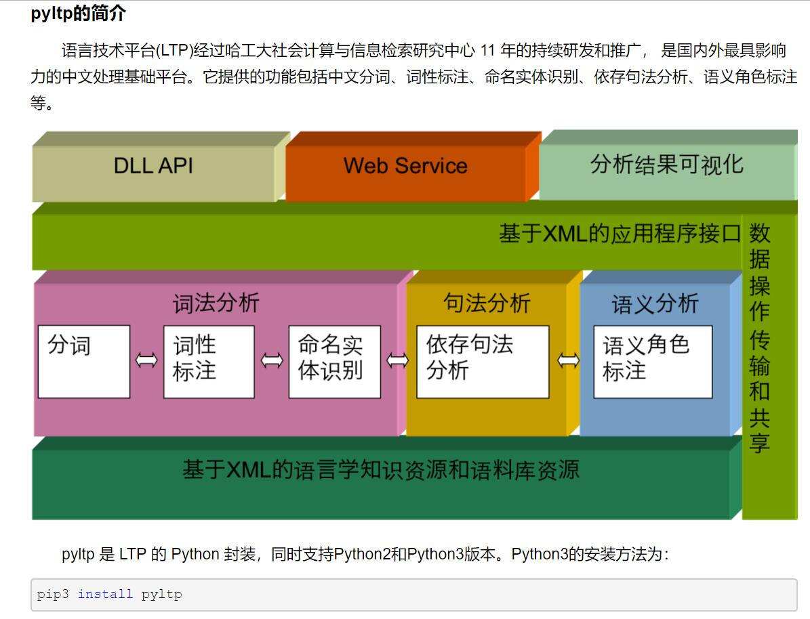

## Assignmet: run-lesson-05-assignment.ipynb

## 项目1

- Project-01[新闻任务言论自动提取]已整理，详情见：https://github.com/Valuebai/NewsInfo-Auto-Extration

## 笔记

1. 基于Word2Vec模型的类似词搜索方法，动态规划思想加速搜索过程
2. TFIDF文本向量表示方法
  - 利用TFIDF向量化的文本计算文本之间相似度
  - 对输入查询字段(关键词组合)进行向量化，找出和查询字段最相似的文本。
  - 在找出的相似文本中标记或加粗查询字段
3. 使用networkx模块实现PageRank算法，并可视化
4. 各类语言分析模块介绍，例如：pyltp CoreNLP

**NLP common Tools**

- NER
- TFIDF
- wordcloud
- 用jieba 词性——解决80%左右的问题
- jieba, pyltp,coreNLP 三个的比较

- pyltp 中文分词的使用

**面试题：为什么要用cos距离，夹角的距离来计算文本的相似度呢？**

- Project-01[新闻任务言论自动提取]已整理，详情见：https://github.com/Valuebai/NewsInfo-Auto-Extration

## Project-01 参考
1. https://github.com/zhangxu999/opinon_extraction ， http://39.100.3.165:8421/index.html
Amazing4 zhangxu1573@qq.com

2、https://github.com/RyanPeking/Automatic-view-extraction

## 开课吧给出的模范

https://github.com/MingDuoLin/News-speech-extraction